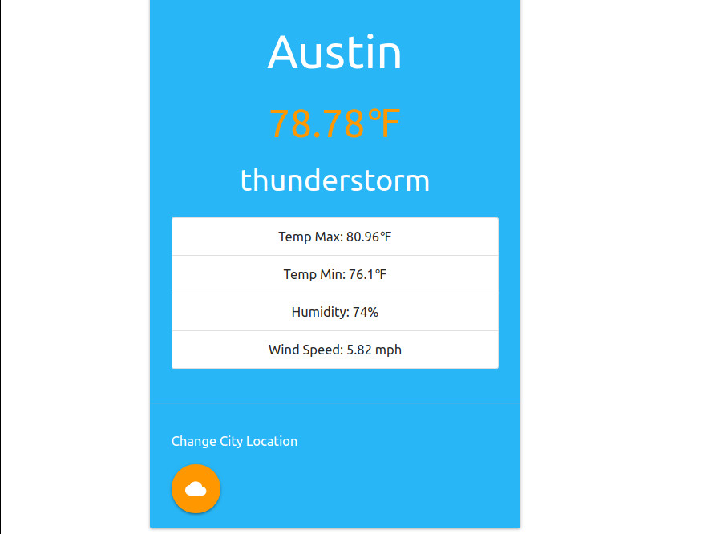

# Weather API App

## Live Demo
Click for a [Live Demo Here](http://apps.javierlona.com/weather/)

## Description
Retrieve the weather information for any city utilizing OpenWeatherMap.org API. The city name and weather information gets stored in local storage.

## Technologies
Materialize CSS, Vanilla JavaScript, OpenWeatherMap API
